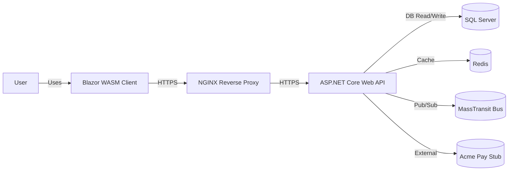
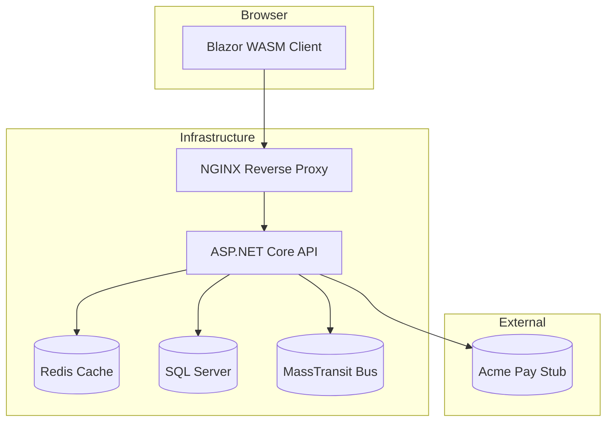

# High-Level Architecture

This document consolidates the overall system context and container layout into Mermaid.js diagrams.

## System Context

```mermaid
graph LR
    User[User] -->|Uses| BlazorClient[Blazor WASM Client]
    BlazorClient -->|HTTPS| Nginx[NGINX Reverse Proxy]
    Nginx -->|HTTPS| Api[ASP.NET Core Web API]
    Api -->|DB Read/Write| Sql[(SQL Server)]
    Api -->|Cache| Redis[(Redis)]
    Api -->|Pub/Sub| Bus[(MassTransit Bus)]
    Api -->|External| AcmeStub[(Acme Pay Stub)]
```

## Container Diagram

```mermaid
graph TD
    subgraph Browser
      BlazorClient[Blazor WASM Client]
    end

    subgraph Infrastructure
      Nginx[NGINX Reverse Proxy]
      Api[ASP.NET Core API]
      Redis[(Redis Cache)]
      Sql[(SQL Server)]
      Bus[(MassTransit Bus)]
    end

    subgraph External
      AcmeStub[(Acme Pay Stub)]
    end

    BlazorClient --> Nginx --> Api
    Api --> Sql
    Api --> Redis
    Api --> Bus
    Api --> AcmeStub
```
